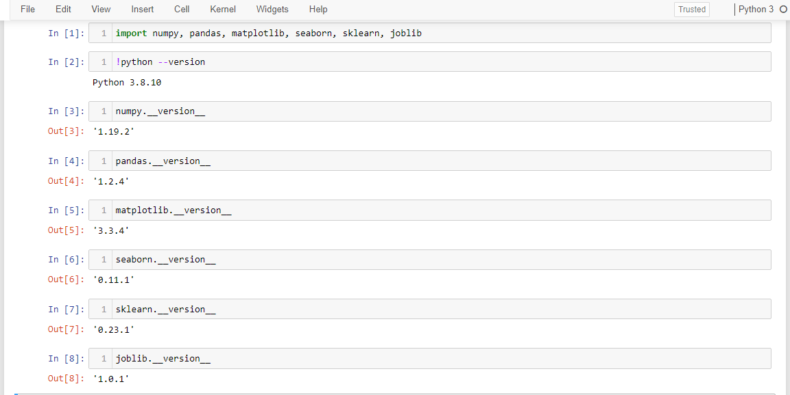

# Predicting heart disease or not, using machine learning

Predicting whether or not a patient has heart disease based on given clinical parameters about the patient.  
This is a single notebook project which demonstrates some foundational machine learning and data science concepts by exploring the problem of heart disease classification.  

## Environment requirments

This project is a single jupyter notebook(.ipynb file) in Python3.  
The version of Python and other libraries are,  
  
Can create the same environment (used to do create this project .ipynb file) with the use of the [environment.txt](https://github.com/kdineshchitra/heart-disease-prediction/blob/master/environment.txt) or [environment.yml](https://github.com/kdineshchitra/heart-disease-prediction/blob/master/environment.yml) file.

## Problem Statement

**Supervised Learning - Binary Classification Problem:** Classify a patient between the classes of having heart disease and  not having heart disease, based on patient's medical parameters.  

## Data for the problem

Data is structured(303 rows and 14 columns) and it is in the form of a '.csv' file.
The original data came from the Cleveland database from UCI Machine Learning Repository.[(link here)](https://archive.ics.uci.edu/ml/datasets/Heart+Disease/)  
The following features were used to predict the target variable (heart disease or no heart disease).  
1. age
2. sex
3. cp
4.trestbps
5. chol
6. fbs
7. restecg
8. thalach
9. exang
10. oldpeak
11. slope
12. ca
13. thal  

There is a complete version of data dictionary in the [heart-disease-classification.ipynb](https://github.com/kdineshchitra/heart-disease-prediction/blob/master/heart-disease-classification.ipynb) file.  

## Data Cleaning & Preprocessing

Data has 303 examples(rows) with 13 features + 1 label variable(14 columns). All the values came in **Numerical datatypes** and there were **no missing values**.  
Since the dataset is fully filled and in the form of numbers ready to feed into a ML model, there is no need for imputation(filling missing values) and feature encoding(converting non-numerical data to numerical data).  
The dataset is separated into features(X) and labels(y) then later on splitted into training and testing sets for model training and evaluation.

## Exploratory Data Analysis(EDA)

Basic and commonly used EDA concepts and ideas are applied on given data to extract insights and to understand it.  
The relation between the features and how they affect the target label is analyzed for the features Age, Sex, Maximum heart rate(thalach), Chest pain type(cp).  
  
Finally the correlation matrix was formed to explore the relation between all variables and most importantly to get an idea of which independent variables may or may not have an impact on the target variable.

## Model building & Performance

Models/algorithms used in this notebook are,
- [Logistic Regression - LogisticRegression()](https://scikit-learn.org/stable/modules/generated/sklearn.linear_model.LogisticRegression.html)
- [K-Nearest Neighbors - KNeighboursClassifier()](https://scikit-learn.org/stable/modules/generated/sklearn.neighbors.KNeighborsClassifier.html)
- [RandomForest - RandomForestClassifier()](https://scikit-learn.org/stable/modules/generated/sklearn.ensemble.RandomForestClassifier.html)

There are more classification algorithms out there; but for simplicity, clarity and understanding the process these 3 commonly used essential classification algorithms were choosed and utilized.  
Model training and evaluation are done between these 3.  
In the process of finding the best fit model for this particular problem & data from these 3 models, certain evaluation metrics are used and compared.  
The metrics such as,
- Confusion Matrix
- The ROC curve and AUC score
- Classification report
- Accuracy Score
- Precision
- Recall
- F1-score  

are used.  

  

Finally the best 2 out of these 3 models are used to analyze the feature importances.  

|  |  |
|--------|--------|

## Further experiment and analysis

***Apart from the things which were tried in this project, there are so many methods and ways to explore a structured dataset and extract insights from it.***  
In addition to these, the other ideas or concepts can be used to utilize this data and extract more insights.  
Such as,  
- Collecting more data
- Trying different algorithms to build an error-free model, like, CatBoost, XGBoost, LinearSVC. Naive Bayes Classifiers, etc.,
- Trying different hyperparameters for tuning the current models.
- Modifying/Improving the model evaluation methods & metrics

The machine learning model creation, training and development are always an iterative experimentation process. Every problems and questions which are required answer have their own different kind of solutions. Approaching different problems in their own ways within the given situation and statements is important.  
Starting with understanding the problem statement, which question is to be answered, why and how much it is to solve are paramount.  

---
Thanks for viewing this project and my [Github Profile](https://github.com/kdineshchitra).  
Please provide your thoughts and insights to this little project.  
Always ready to collaborate, learn and grow with others. See you in my next project.
